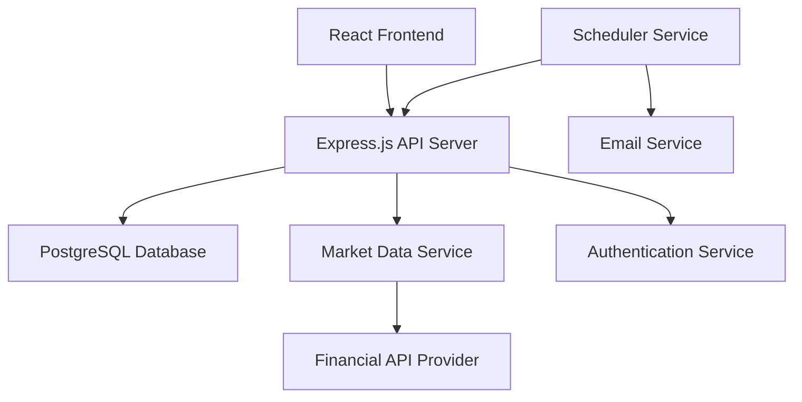

# Portfolio Tracker Design Document

## Overview

The Portfolio Tracker is a full-stack web application built with a React frontend and Node.js backend. The system integrates with financial market APIs to provide real-time stock data, stores user portfolio information in a database, and includes a scheduled service for daily updates. The architecture emphasizes modularity, scalability, and reliable data handling.

## Architecture

### High-Level Architecture



### Technology Stack

- **Frontend**: React with TypeScript, Chart.js for visualizations, Material-UI for components
- **Backend**: Node.js with Express.js, TypeScript
- **Database**: PostgreSQL with Prisma ORM
- **Market Data**: Alpha Vantage API (free tier with fallback to Yahoo Finance)
- **Authentication**: JWT tokens with bcrypt for password hashing
- **Scheduling**: node-cron for daily updates
- **Email**: Nodemailer for daily update notifications
- **Deployment**: Docker containers with environment-based configuration

## Components and Interfaces

### Frontend Components

#### Portfolio Dashboard
- **Purpose**: Main interface displaying portfolio overview and key metrics
- **Props**: `portfolioData: PortfolioSummary`, `loading: boolean`
- **Features**: Total value, daily change, sector allocation chart, top performers/losers

#### Stock Position Manager
- **Purpose**: Add, edit, and delete stock positions
- **Props**: `positions: StockPosition[]`, `onAdd: Function`, `onEdit: Function`, `onDelete: Function`
- **Features**: Form validation, stock symbol autocomplete, bulk operations

#### Analytics Dashboard
- **Purpose**: Detailed portfolio analysis and historical performance
- **Props**: `analyticsData: PortfolioAnalytics`, `timeRange: string`
- **Features**: Sector breakdown, market cap distribution, performance charts, benchmark comparison

#### Daily Update Settings
- **Purpose**: Configure notification preferences
- **Props**: `settings: NotificationSettings`, `onUpdate: Function`
- **Features**: Email preferences, update frequency, alert thresholds

### Backend Services

#### Portfolio Service
```typescript
interface PortfolioService {
  addPosition(userId: string, position: CreatePositionDto): Promise<StockPosition>
  updatePosition(positionId: string, updates: UpdatePositionDto): Promise<StockPosition>
  deletePosition(positionId: string): Promise<void>
  getPortfolio(userId: string): Promise<Portfolio>
  calculatePortfolioMetrics(userId: string): Promise<PortfolioMetrics>
}
```

#### Market Data Service
```typescript
interface MarketDataService {
  getCurrentPrice(symbol: string): Promise<StockPrice>
  validateSymbol(symbol: string): Promise<boolean>
  getBatchPrices(symbols: string[]): Promise<StockPrice[]>
  getHistoricalData(symbol: string, period: string): Promise<HistoricalPrice[]>
}
```

#### Analytics Service
```typescript
interface AnalyticsService {
  calculateSectorAllocation(portfolio: Portfolio): Promise<SectorAllocation[]>
  calculateMarketCapDistribution(portfolio: Portfolio): Promise<MarketCapDistribution>
  generatePerformanceReport(userId: string): Promise<PerformanceReport>
  compareWithBenchmark(portfolio: Portfolio, benchmark: string): Promise<BenchmarkComparison>
}
```

#### Notification Service
```typescript
interface NotificationService {
  sendDailyUpdate(userId: string, report: DailyReport): Promise<void>
  scheduleUpdates(): void
  generateDailyReport(userId: string): Promise<DailyReport>
}
```

## Data Models

### Core Entities

#### User
```typescript
interface User {
  id: string
  email: string
  passwordHash: string
  firstName: string
  lastName: string
  notificationSettings: NotificationSettings
  createdAt: Date
  updatedAt: Date
}
```

#### StockPosition
```typescript
interface StockPosition {
  id: string
  userId: string
  symbol: string
  companyName: string
  quantity: number
  purchasePrice: number
  purchaseDate: Date
  currentPrice?: number
  sector?: string
  marketCap?: string
  createdAt: Date
  updatedAt: Date
}
```

#### Portfolio
```typescript
interface Portfolio {
  userId: string
  positions: StockPosition[]
  totalValue: number
  totalCost: number
  unrealizedGainLoss: number
  unrealizedGainLossPercent: number
  lastUpdated: Date
}
```

#### PortfolioMetrics
```typescript
interface PortfolioMetrics {
  totalValue: number
  dailyChange: number
  dailyChangePercent: number
  totalReturn: number
  totalReturnPercent: number
  sectorAllocation: SectorAllocation[]
  marketCapDistribution: MarketCapDistribution
  topPerformers: StockPosition[]
  topLosers: StockPosition[]
}
```

### API Response Models

#### SectorAllocation
```typescript
interface SectorAllocation {
  sector: string
  value: number
  percentage: number
  positions: number
}
```

#### DailyReport
```typescript
interface DailyReport {
  date: Date
  portfolioValue: number
  dailyChange: number
  dailyChangePercent: number
  significantMovers: StockPosition[]
  sectorPerformance: SectorPerformance[]
  marketSummary: string
}
```

## Error Handling

### API Error Responses
- **400 Bad Request**: Invalid input data with detailed field validation errors
- **401 Unauthorized**: Authentication required or token expired
- **404 Not Found**: Resource not found (position, user, etc.)
- **429 Too Many Requests**: Rate limiting for market data API calls
- **500 Internal Server Error**: Unexpected server errors with error tracking

### Market Data Fallback Strategy
1. **Primary**: Alpha Vantage API for real-time data
2. **Secondary**: Yahoo Finance API if primary fails
3. **Tertiary**: Cached data with staleness indicators
4. **Final**: Manual price entry option for critical updates

### Database Error Handling
- Connection pooling with automatic retry logic
- Transaction rollback for data consistency
- Backup and recovery procedures for data protection
- Migration scripts for schema updates

### Frontend Error Boundaries
- Global error boundary for unhandled React errors
- Network error handling with retry mechanisms
- Form validation with real-time feedback
- Graceful degradation when services are unavailable

## Testing Strategy

### Unit Testing
- **Backend**: Jest for service layer testing, mock external APIs
- **Frontend**: React Testing Library for component testing
- **Database**: In-memory database for repository layer tests
- **Coverage Target**: 80% code coverage minimum

### Integration Testing
- API endpoint testing with supertest
- Database integration tests with test containers
- Market data service integration with API mocking
- Email service testing with mock SMTP server

### End-to-End Testing
- Cypress for critical user journeys
- Portfolio creation and management workflows
- Daily update generation and delivery
- Authentication and authorization flows

### Performance Testing
- Load testing for concurrent users
- Database query optimization testing
- Market data API rate limit handling
- Frontend bundle size and loading performance

### Security Testing
- Authentication and authorization testing
- Input validation and SQL injection prevention
- API rate limiting and abuse prevention
- Data encryption and secure storage validation

## Deployment and Infrastructure

### Development Environment
- Docker Compose for local development
- Environment variables for configuration
- Hot reloading for frontend and backend
- Database seeding scripts for test data

### Production Environment
- Containerized deployment with Docker
- Environment-specific configuration management
- SSL/TLS encryption for all communications
- Database connection pooling and optimization
- Monitoring and logging with structured logs
- Automated backup and disaster recovery procedures